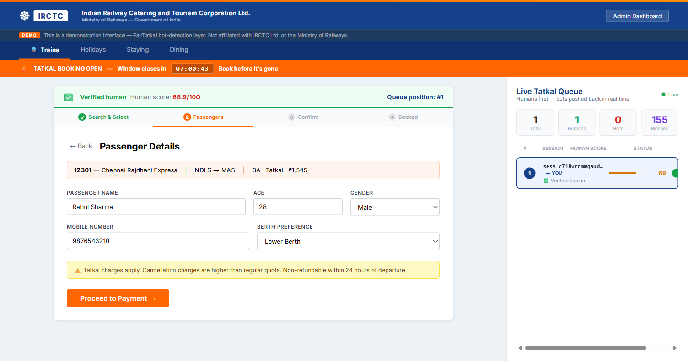
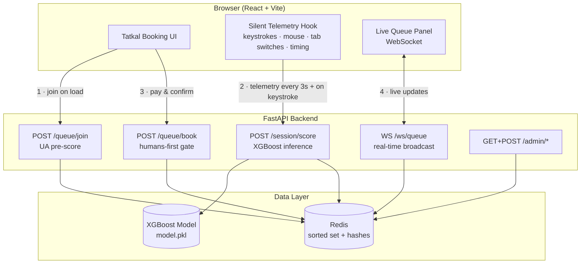
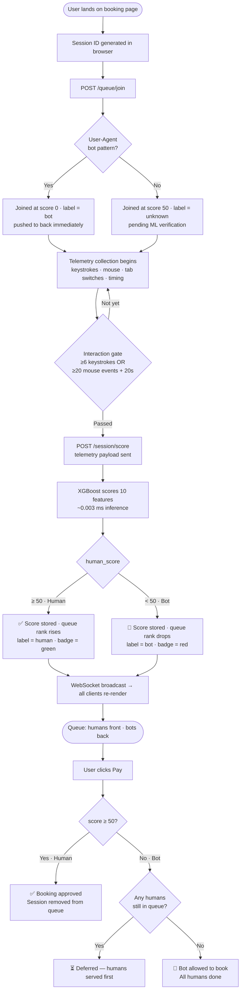
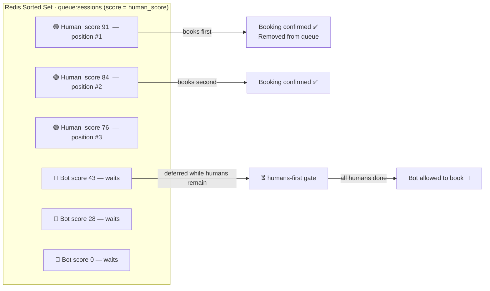
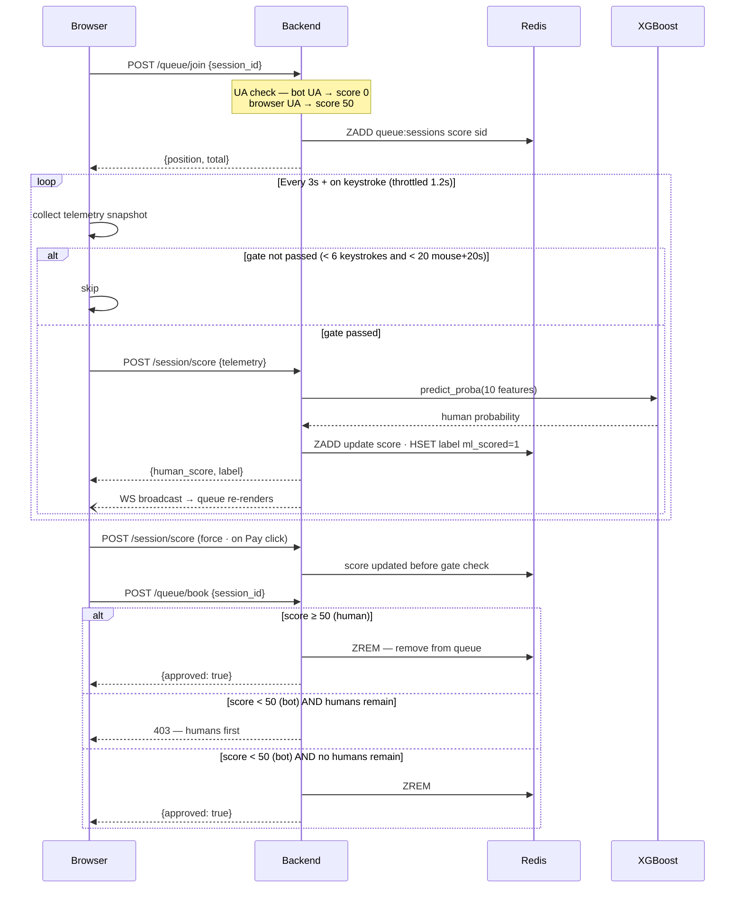

# FairTatkal

**Behavioral bot detection and fair-access queue for Indian Railways Tatkal booking.**

[](https://python.org)
[](https://fastapi.tiangolo.com)
[](https://react.dev)
[](https://xgboost.readthedocs.io)
[](https://redis.io)
---

## Screenshots

**Booking UI — 20 bots in queue, humans verified and pushed to front**


**Passenger form — human scored 68.9/100, holding position #1 while bots wait**


**Live queue — humans at top, bots cascading to back with falling scores**


**Admin dashboard — 81% detection rate, 153 bot attempts blocked**


---

## The Problem

Indian Railways blocked **60 billion bot requests** in six months (Jul–Dec 2025).
**92,877 genuine passengers** lost confirmed Tatkal tickets every single day in FY 2025–26.

Automated scripts drain Tatkal quotas in seconds. Real passengers are left with waitlisted tickets while bots hoard seats for resellers. IRCTC's primary defense is CAPTCHA — which modern bots solve in under 200 ms.

---

## How FairTatkal Works

FairTatkal runs a **behavioral fingerprinting layer** that silently analyzes *how* a user interacts with the booking form — keystroke cadence, mouse trajectory, field timing, tab switches, and more — without ever interrupting them with a puzzle.

```
Dumb bot:        8 fields in 40 ms · zero mouse · no tab switches  →  score   5 / 100
Adversarial bot: jittered timing · faked mouse · browser UA         →  score  38 / 100
Human:           natural typing · organic mouse path · tab switches →  score  82 / 100
```

Every active session carries a continuously updated human-likelihood score. The booking queue is a **Redis sorted set** keyed on that score — humans hold the front, bots are pushed to the back in real time. Bots are never hard-blocked from the queue; they simply wait at the back until all humans have booked.

---

## System Architecture



---

## Bot Detection Flow



---

## Queue Priority Model



Scores update on every telemetry event. A bot that adds artificial delays to mimic humans will still be caught — the model was trained on an **adversarial bot class** with randomized keystroke jitter and browser user-agent spoofing.

---

## Behavioral Features

The XGBoost model uses 10 features extracted silently from raw browser telemetry:

| Feature | Dumb bot | Adversarial bot | Human |
|---|---|---|---|
| Keystroke interval variance (ms) | < 5 | 20–50 | 80–300 |
| Average keystroke interval (ms) | < 20 | 90–150 | 200–400 |
| Mouse movement count | 0–3 | 25–70 | 80–500 |
| Mouse entropy (direction std-dev, rad) | ~0.02 | 0.40–0.62 | 1.5–2.8 |
| Average field fill speed (ms) | 15–50 | 400–1,100 | 1,500–3,000 |
| Instant fills (< 80 ms) | 4–8 | 1–2 | 0 |
| Time on page (s) | 0.5–3 | 10–28 | 30–120 |
| Tab switches | 0 | 0–1 | 1–6 |
| WebDriver flag absent | Often no | Yes | Yes |
| Fields filled | 8 instantly | 4–6 | 2–3 progressively |

**Model training:** 10,000 synthetic sessions — 6,000 human (rush + careful profiles) · 4,000 bot (dumb + adversarial).
**AUC-ROC:** 0.961 &nbsp;|&nbsp; **False positive rate** (humans flagged as bot): < 3%

Telemetry scoring is gated until `≥ 6 keystroke intervals` or `≥ 20 mouse events + 20 s on page` to avoid penalising a session that just loaded the page. A force-score fires immediately when the user clicks Pay to ensure the gate always has fresh data at booking time.

---

## Scoring & Booking Gate



---

## API Reference

| Method | Endpoint | Auth | Description |
|---|---|---|---|
| `GET` | `/health` | — | Liveness check |
| `POST` | `/queue/join` | — | Register session · bot UAs score 0 · browser UAs score 50 |
| `GET` | `/queue/status/{session_id}` | — | Current score + queue position |
| `POST` | `/session/score` | — | Submit telemetry · XGBoost inference · update queue rank |
| `POST` | `/queue/book` | — | Booking gate · humans pass · bots wait for humans to finish |
| `WS` | `/ws/queue` | — | Real-time queue snapshot stream (1 s tick) |
| `GET` | `/admin/stats` | `X-Admin-Key` | Detection counters + live session list |
| `POST` | `/admin/reset` | `X-Admin-Key` | Flush queue and session state |

Full interactive docs at `http://localhost:8000/docs` when running locally.

---

## Quick Start

**Prerequisites:** Python 3.11+, Node 18+, Docker

```bash
git clone https://github.com/thulasiramk-2310/FAIRTATKAL.git
cd FAIRTATKAL

# 1. Start Redis
docker compose up -d

# 2. Set up environment
cp backend/.env.example backend/.env
# Edit backend/.env — set your SECRET_KEY and ADMIN_KEY

# 3. Train the ML model (one time only)
cd backend
pip install -r requirements.txt
python -m app.ml.train

# 4. Start backend
uvicorn app.main:app --reload --port 8000

# 5. Start frontend (new terminal)
cd ../frontend
npm install && npm run dev
```

| URL | Purpose |
|---|---|
| http://localhost:5173 | Booking UI + live queue panel |
| http://localhost:5173/admin | Admin operations dashboard |
| http://localhost:8000/docs | Interactive API docs (Swagger) |

---

## Bot Simulator

A pure-Python async bot swarm ships with the project for live demos and load testing.

```bash
cd simulator
pip install -r requirements.txt

# 20 dumb bots (obvious bot UAs, instant fills)
python bot_sim.py --count 20 --type dumb

# 20 adversarial bots (browser UAs, jittered timing, faked mouse)
python bot_sim.py --count 20 --type adversarial

# Mixed swarm + attempt booking to test the gate
python bot_sim.py --count 20 --type mixed --book

# High-volume demo flood
python bot_sim.py --count 50 --type mixed --delay 0.05
```

**Bot types:**

| Type | User-Agent | Telemetry strategy | Expected score |
|---|---|---|---|
| `dumb` | `python-requests`, `curl`, etc. | Instant fills · zero mouse | 0–15 |
| `adversarial` | Real Chrome/Firefox UA | Jittered keystrokes · faked mouse path · browser UA spoofing | 25–49 |

All bots are pushed to the back of the queue by the scoring model. They can only book after all human sessions (score ≥ 50) have completed their booking.

Reset between demo runs:

```bash
./scripts/demo_reset.sh
```

---

## Running Tests

```bash
cd backend
pytest tests/ -v
```

Tests use an in-process ASGI transport with mocked Redis — no live infrastructure required.

---

## Tech Stack

| Layer | Technology |
|---|---|
| Backend API | FastAPI, Uvicorn, Pydantic v2, SlowAPI rate limiting |
| Queue store | Redis — sorted sets (score = human score) + hashes (session state) |
| ML model | XGBoost, scikit-learn, NumPy, joblib |
| Real-time | WebSocket (Starlette native) — 1 s broadcast loop |
| Frontend | React 18, Vite, Framer Motion, Tailwind CSS |
| Bot simulator | Python asyncio + httpx (no browser required) |
| Infrastructure | Docker Compose (Redis only — everything else runs locally) |
| Testing | pytest, pytest-asyncio, httpx ASGI transport |

---

## Security Notes

- `.env` is gitignored. Generate your own `SECRET_KEY` and `ADMIN_KEY` from `.env.example`.
- `/admin/*` endpoints require `X-Admin-Key` header matched at request time.
- User-Agent pre-scoring assigns score 0 to known bot clients at join, before ML runs.
- `/session/score` rejects payloads for session IDs that never called `/queue/join` — prevents a bot submitting crafted human telemetry against an arbitrary victim session.
- Rate limiting: 60 req/min on join · 120 req/min on score · 10 req/min on book.
- Booking gate force-scores the session at click time so the gate always has a fresh ML score, not a stale cached value.

---

## Roadmap

- [ ] Device fingerprinting (canvas hash, WebGL renderer, font enumeration)
- [ ] Federated model updates across railway zones — detection improves without centralising raw behavioral data
- [ ] Aadhaar OTP escalation for sessions with human score < 40
- [ ] Real-time demand forecasting to resize queue slots dynamically
- [ ] Public SDK for third-party Indian railway booking platforms

---

> "The queue is finally fair."
