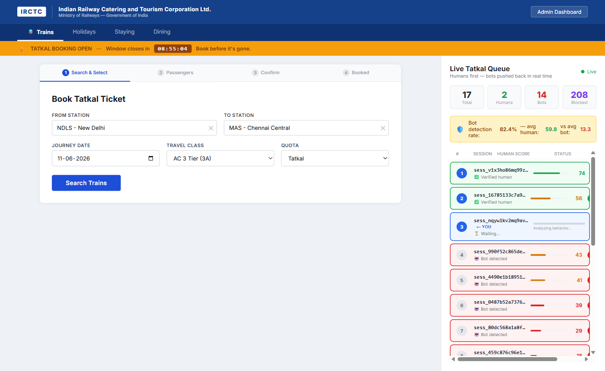
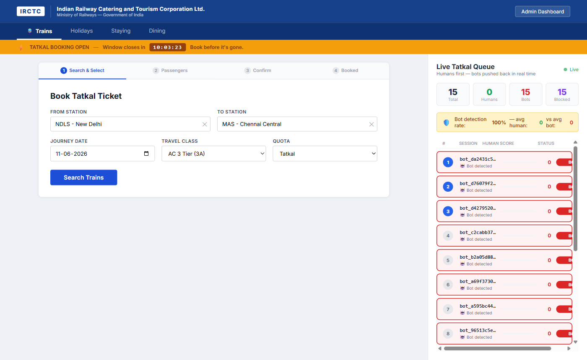
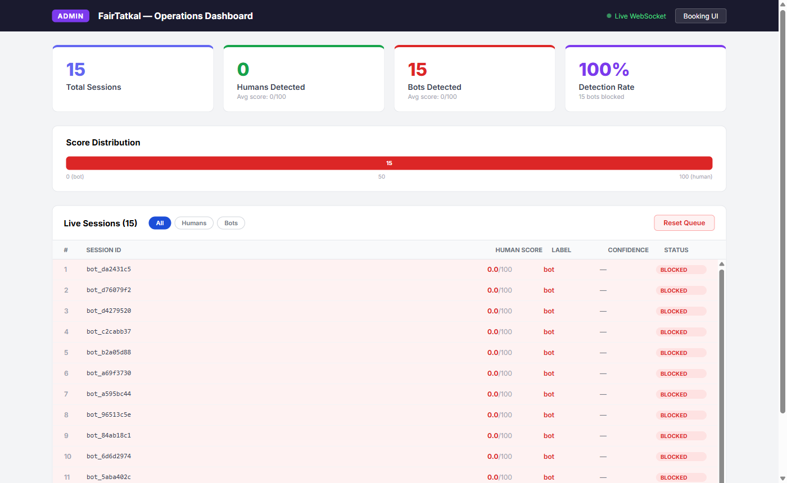
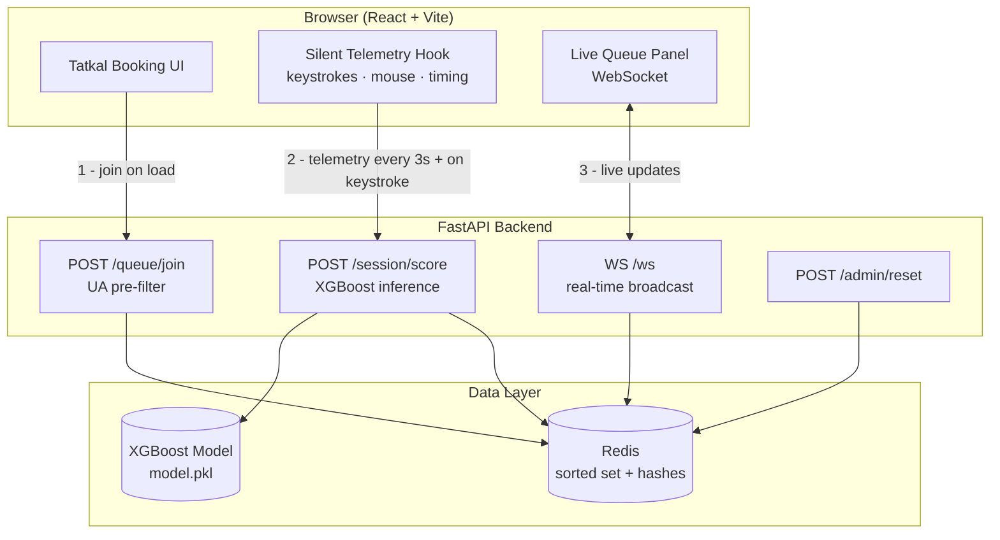
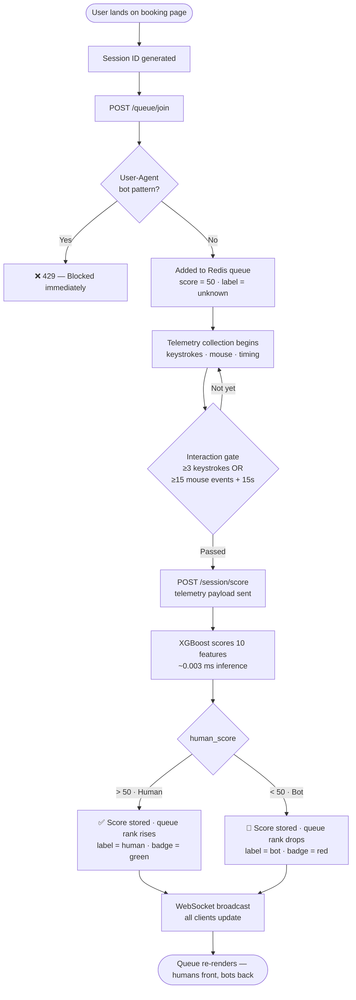
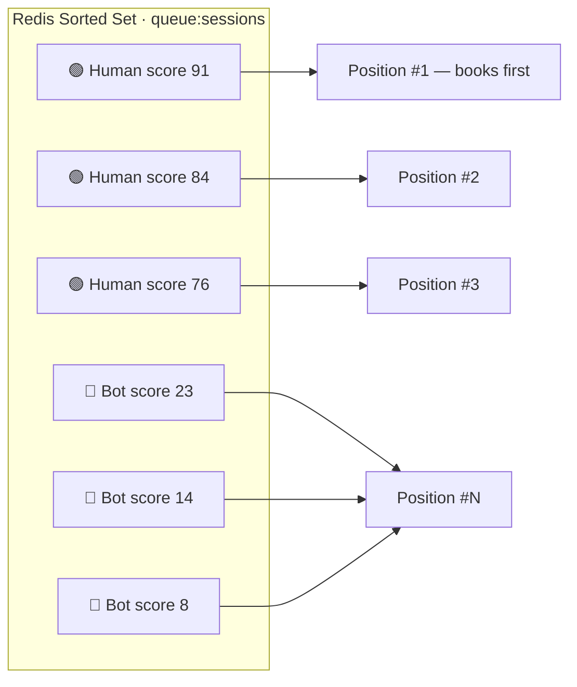
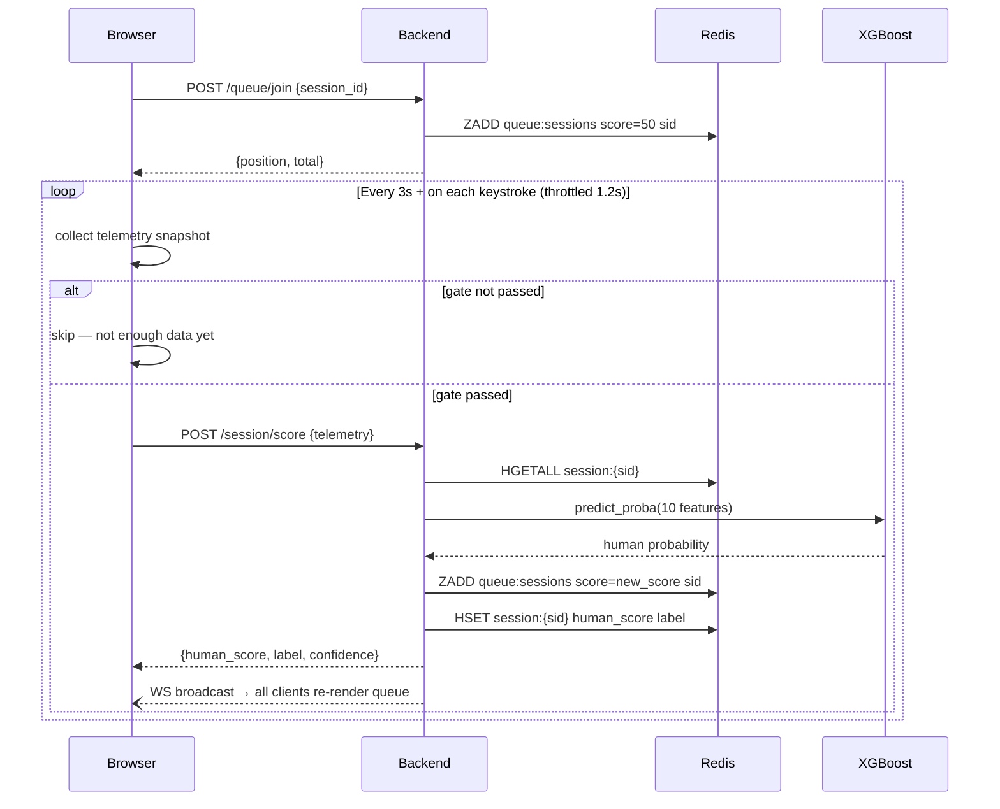

# FairTatkal

**Behavioral bot detection and fair-access queue for Indian Railways Tatkal booking.**

[](https://python.org)
[](https://fastapi.tiangolo.com)
[](https://react.dev)
[](https://xgboost.readthedocs.io)
[](https://redis.io)
[]

---

## Screenshots

**Booking UI — empty queue on load**


**Live queue — 15 bots detected and pushed to back (100% detection rate)**


**Admin dashboard — real-time detection stats**


---

## The Problem

Indian Railways blocked **60 billion bot requests** in six months (Jul–Dec 2025).  
**92,877 genuine passengers** lost confirmed Tatkal tickets every single day in FY 2025–26.

Automated scripts drain Tatkal quotas in seconds. Real passengers are left with waitlisted tickets while bots hoard seats for resellers. IRCTC's primary defense is CAPTCHA — which modern bots solve in under 200 ms.

---

## How FairTatkal Works

FairTatkal runs a **behavioral fingerprinting layer** that silently analyzes *how* a user interacts with the booking form — keystroke cadence, mouse trajectory, field timing, and more — without ever interrupting them with a puzzle.

```
Bot:   8 fields filled in 40 ms · zero mouse movement · instant tab jumps  →  score  12 / 100
Human: natural typing · organic mouse path · hesitation on unfamiliar fields →  score  87 / 100
```

Every active session carries a continuously updated human-likelihood score. The booking queue is a **Redis sorted set** keyed on that score — humans hold the front, bots are pushed to the back in real time.

---

## System Architecture



---

## Bot Detection Flow



---

## Queue Priority Model



Scores are continuous and update on every telemetry event. A bot that adds artificial delays to mimic humans will still be caught — the model was trained on an **adversarial bot class** with randomized keystroke jitter.

---

## Behavioral Features

The XGBoost model uses 10 features extracted from raw telemetry:

| Feature | Bot signature | Human signature |
|---|---|---|
| Keystroke interval variance | < 10 ms | 150–300 ms |
| Average keystroke interval | < 50 ms | 200–400 ms |
| Mouse movement count | 0–3 | 40–400+ |
| Mouse entropy (direction spread) | ~0.01 rad | ~1.8 rad |
| Average field fill speed | 15–50 ms | 1,500–2,500 ms |
| Instant fills (< 80 ms) | 4–8 | 0–1 |
| Time on page | 0.5–3 s | 30–120 s |
| Tab switches | 0 | 2–6 |
| WebDriver flag consistent | Often `true` | `false` |
| Fields filled | 8 instantly | 2–3 at a time |

**Model training:** 10,000 synthetic sessions — 6,000 human (rush + careful profiles) · 4,000 bot (dumb + adversarial).  
**AUC-ROC:** 0.961 &nbsp;|&nbsp; **False positive rate** (humans flagged): < 3%

Scoring is gated until `≥ 3 keystroke intervals` or `≥ 15 mouse events + 15 s on page` to avoid penalizing a session that just loaded the page.

---

## Scoring Gate Logic



---

## API Reference

| Method | Endpoint | Auth | Description |
|---|---|---|---|
| `GET` | `/health` | — | Liveness check |
| `POST` | `/queue/join` | — | Register session, returns initial position |
| `GET` | `/queue/status/{session_id}` | — | Current score + position |
| `POST` | `/session/score` | — | Submit telemetry, get human score |
| `WS` | `/ws` | — | Real-time queue snapshot stream |
| `GET` | `/admin/stats` | `X-Admin-Key` | Detection counters |
| `POST` | `/admin/reset` | `X-Admin-Key` | Flush queue and session state |

Full interactive docs at `http://localhost:8000/docs` when running locally.

---

## Quick Start

**Prerequisites:** Python 3.11+, Node 18+, Docker

```bash
git clone https://github.com/thulasiramk-2310/FAIRTATKAL.git
cd FAIRTATKAL

# 1. Start Redis
docker compose up -d

# 2. Set up environment
cp backend/.env.example backend/.env
# Edit backend/.env — generate SECRET_KEY and ADMIN_KEY per the comments inside

# 3. Train the ML model (one time)
cd backend
pip install -r requirements.txt
python -m app.ml.train

# 4. Start backend
uvicorn app.main:app --reload --port 8000

# 5. Start frontend
cd ../frontend
npm install && npm run dev
```

| URL | Purpose |
|---|---|
| http://localhost:5173 | Booking UI + live queue |
| http://localhost:5173/admin | Admin dashboard |
| http://localhost:8000/docs | Interactive API docs |

---

## Bot Simulator

A Playwright-based bot swarm ships with the project for load testing and live demos.

```bash
cd simulator
pip install -r requirements.txt

# Launch 20 concurrent bots
python bot_sim.py --count 20

# Tune aggression
python bot_sim.py --count 50 --delay 0.02
```

Bots fill all 8 form fields programmatically in under 50 ms, generating feature vectors that sit far outside the human training distribution. Watch them score red and sink to the queue bottom in real time on the admin dashboard.

Reset between runs:

```bash
./scripts/demo_reset.sh   # flushes Redis + session state
```

---

## Running Tests

```bash
cd backend
pytest tests/ -v
```

Tests mock Redis entirely — no live infrastructure required. Coverage: health check, queue join (with browser UA validation), admin reset authentication.

---

## Tech Stack

| Layer | Technology |
|---|---|
| Backend API | FastAPI, Uvicorn, Pydantic v2 |
| Queue store | Redis — sorted sets + hashes |
| ML model | XGBoost, scikit-learn, NumPy, joblib |
| Real-time | WebSocket (Starlette native) |
| Frontend | React 18, Vite, Tailwind CSS |
| Bot simulator | Playwright (Python async) |
| Infrastructure | Docker Compose (Redis only) |
| Testing | pytest, pytest-asyncio, httpx ASGI transport |

---

## Security Notes

- `.env` is gitignored. Generate your own keys using the instructions in `.env.example`.
- `/admin/*` endpoints require `X-Admin-Key` header. Key is validated at startup; a weak default triggers a warning.
- User-Agent pre-filtering rejects headless-browser and scripted HTTP clients at join time, before ML scoring runs.
- Telemetry scoring requires the session to have joined the queue first — prevents a bot from submitting crafted human telemetry against an arbitrary session ID.
- Rate limiting on all endpoints: 60 req/min on join, 120 req/min on score.

---

## Roadmap

- [ ] Device fingerprinting (canvas hash, WebGL renderer, font enumeration)
- [ ] Federated model updates across railway zones — detection improves without centralising raw behavioral data
- [ ] Aadhaar OTP escalation for sessions with human score < 40
- [ ] Real-time demand forecasting to resize queue slots dynamically
- [ ] Public SDK for third-party Indian railway booking platforms

---

## License

All rights reserved. This project was built for the FAR AWAY 2026 hackathon and is not open-sourced. No part of this codebase may be copied, modified, or distributed without explicit permission from the authors.

---

> "The queue is finally fair."
